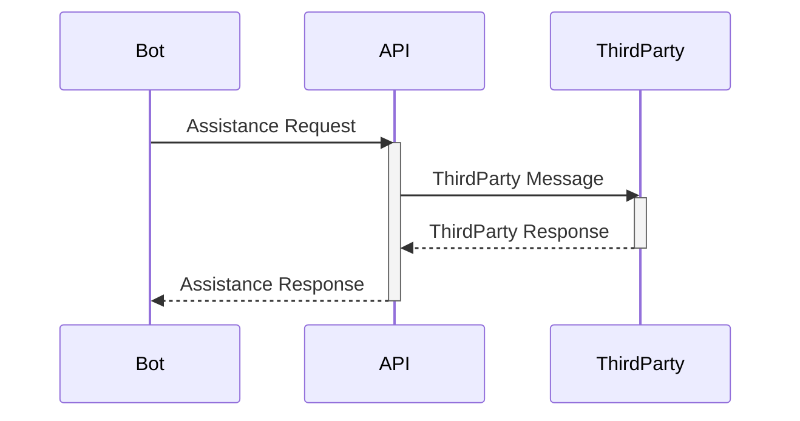
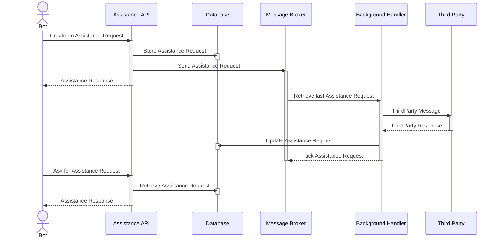
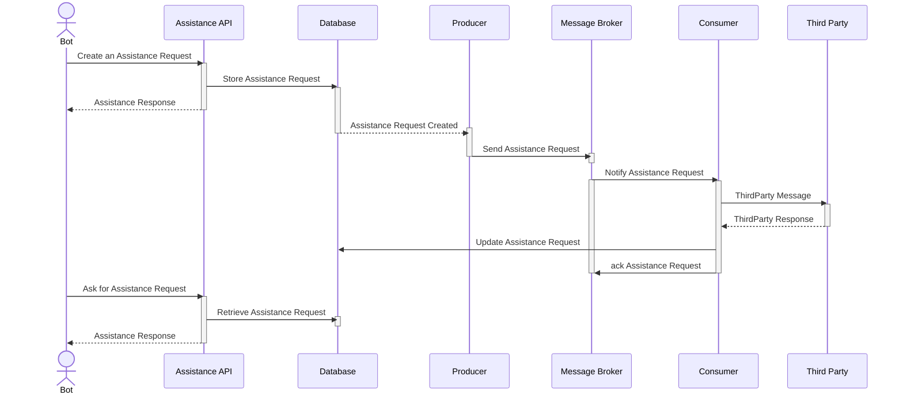
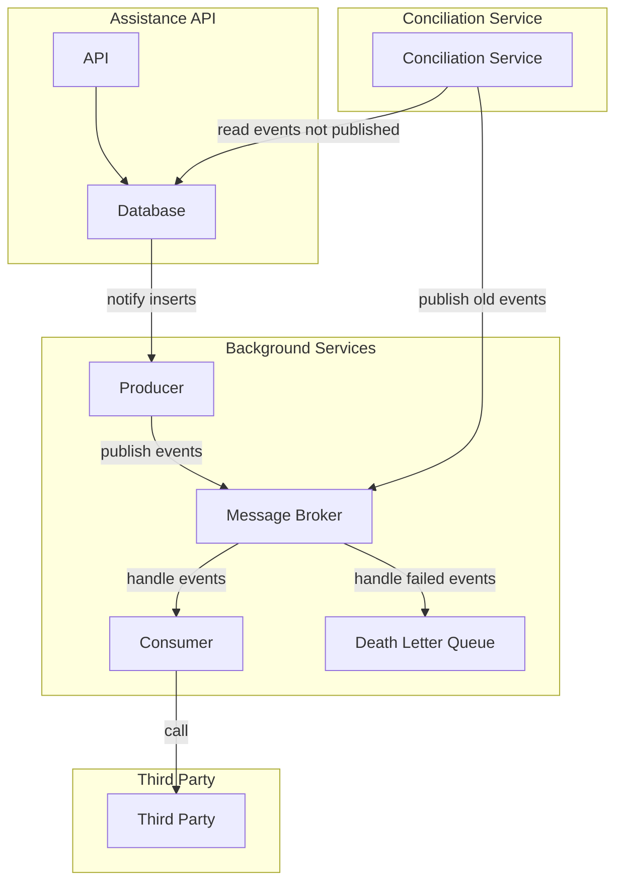

# Landbot Backend Challenge

## Context

The product department wants a system to be notified when a customer requests assistance from a bot. The bot will make an http call (like a webhook) with the following information:

Topic: a string with values can be sales or pricing
Description: a string with a description of the problem that needs assistance from.
You need to expose an API endpoint that will receive this call and depending on the selected topic will forward it to a different channel:

| Topic | Channel |
| - | - |
| Sales | Slack |
| Pricing | Email |

## Known Issues

### Consistency

Third-party services may fail during the assistance request process. This could be due to server downtime or an inability to process the request. Implementing fallback mechanisms and retry policies can mitigate this issue.

### Performance

Third-party services may respond slowly to assistance requests due to server overload or processing delays. A timeout mechanism and/or a separate thread to handle third-party responses can prevent the bot from being blocked.

### Scalability

The product team may require support for additional communication channels, leading to the integration of more third-party services. Consequently, the solution must be scalable to accommodate these additions. A modular architecture can facilitate this by allowing new third-party services to be integrated without affecting existing ones.

As the volume of assistance requests grows, a distributed architecture using multiple instances to handle requests in parallel can improve scalability.

## Evaluated options

### Option 1: Call directly the third party API

This is the simplest approach, where the bot directly calls the third-party API via an internal API. However, this approach blocks the bot until the third-party service responds.

Pros:

- Simple to implement.

Cons:

- The bot is blocked if the third-party service is slow to respond.
- If the third-party service is down, the bot cannot process the request.
- The bot must handle all third-party errors.

### Option 2: Asyncronous request handling

This approach separates request processing into two steps: (1) creating and storing the assistance request, and (2) asynchronously calling the third-party API and updating the request status.

Pros:

- The bot is not blocked while waiting for a third-party response.
- Errors in third-party integrations are isolated from bot execution.
- Enables retry policies.
- Background services can scale independently of the API workload.

Cons:

- The bot must poll the database for updates.
- The background service requires a mechanism to process each request only once, even during restarts or scaling.
- Additional complexity is required to handle consistency issues when publishing messages and updating the database.

### Option 3: Outbox pattern

This approach builds upon the second option by using the Outbox pattern to notify changes in storage and leveraging a message broker infrastructure for processing integrations.

This approach inherits every pro and con from the second option, extending some of them as we comment below.

Pros:

- Facilitates scalability by isolating integrations through separate components.
- Simplifies system expansion, allowing additional consumers to handle new requirements.

Cons:

- Requires additional components for message consistency and event tracking.
- May introduce vendor lock-in due to reliance on storage features for the Outbox pattern.
- Event-driven architectures introduce complexities such as event duplication and compensation mechanisms.

## Decision Outcome

Given the scope of the challenge, I chose to implement the third option, the Outbox pattern. This approach balances complexity and scalability, allowing for error handling and retry mechanisms while ensuring the bot can continue processing requests asynchronously.

However, this approach requires additional components, including a reconciliation service to manage the Outbox pattern and a message broker for handling messages. These components introduce maintenance and monitoring overhead.

### Solution design

To implement the solution we will need the following components:

- **Assistance API**: Exposes an endpoint to receive the bot's assistance request.
- **Database**: Stores the assistance requests.
- **Producer**: Receives notifications from the database and publishes messages to the message broker.
- **Message Broker**: Receives messages from the producer and sends them to the consumer.
- **Consumer**: Receives messages from the message broker and processes the third party's integration. Each consumer is responsible to ensure that the message is processed only once.
- **Death Letter Queue**: Receives messages that could not be processed by the consumer.
- **Conciliation Service**: Handles the outbox pattern, ensuring that each message is published.
- **Third Party**: Represents the third party's API.

The following diagram illustrates the solution's architecture:

This architecture provides a scalable, fault-tolerant solution for handling assistance requests while ensuring system maintainability and extensibility.
