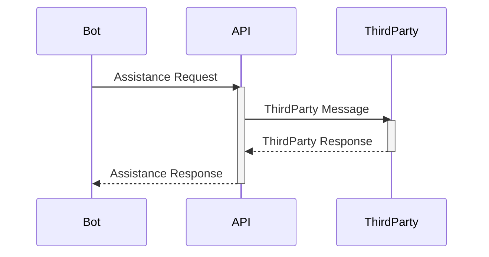
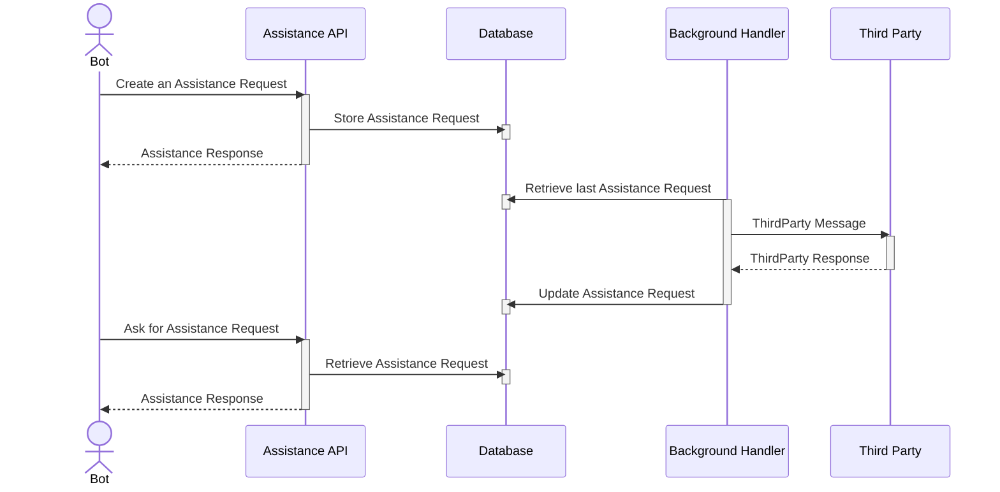
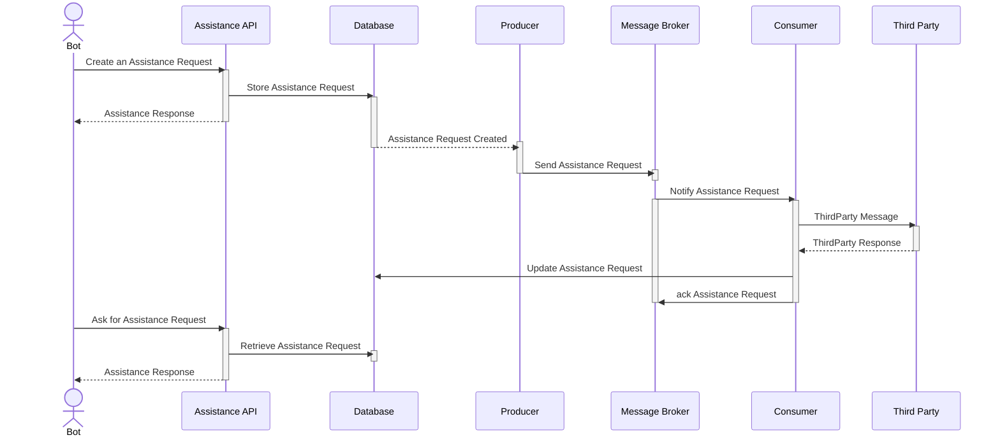

# Landbot Backend Challenge

## Context

The product department wants a system to be notified when a customer requests assistance from a bot. The bot will make an http call (like a webhook) with the following information:

Topic: a string with values can be sales or pricing
Description: a string with a description of the problem that needs assistance from.
You need to expose an API endpoint that will receive this call and depending on the selected topic will forward it to a different channel:

| Topic | Channel |
| - | - |
| Sales | Slack |
| Pricing | Email |

## Known Issues

### Consistency

Third parties could fail during the assistance request process. This could be due to the third party's server being down or the third party's inability to handle the request. Fallback mechanisms and retry policies are potential improvements to address this problem.

### Performance

Third parties may respond slowly to assistance requests. This could be due to an overloaded server or the third party's inability to handle the request on time. A timeout mechanism and/or a separate thread could mitigate this, handling the third party's response so the bot can continue.

### Scalability

The product team may require more channels and, therefore, more third parties. As a consequence, the solution must be able to scale to handle additional third parties. A modular architecture could facilitate this by allowing new third parties to be added easily without affecting the existing ones.

The volume of assistance requests could increase over time. Therefore, a distributed architecture that uses multiple instances to handle them in parallel could address this problem.

### Idempotency

An error in the bot could cause the same assistance request to be sent multiple times. This could be addressed by ensuring that each request is not processed multiple times.

## Evaluated options

### Option 1: Call directly the third party API

This is the most straightforward approach, where the bot directly calls the third party's API through our internal API. The bot will be blocked until the third party responds.

Pros:

- Simple to implement.

Cons:

- If the third party is slow to respond, the bot will be blocked.
- If the third party is down, the bot will not be able to handle the request.
- The bot must handle any error performed by the third party.

### Option 2: Asyncronous request handling

In this case, we propose separating the request into two steps: one creates the assistance request and persists it in storage, and the other processes the request by calling the third party's API and updating the status of the assistance request.

Pros:

- The bot is not blocked and can continue while waiting for the third party's response.
- The assistance request's background service handles any error during the third-party integration, isolating the Bot's execution from any third-party error.
- This architecture enables the implementation of retry policies.
- Background services can scale according to third-party requirements and in an isolated manner from the API workload.

Cons:

- The bot has to poll the database to check if the third party's response is ready.
- The background service requires a mechanism to process each request only once, even when the service restarts or scales.
- The background handler will assume too many responsibilities if the product team demands new functionalities, such as supporting webhooks.

### Option 3: Outbox pattern

The last approach could be considered an improvement on the second option, using the well-known pattern "Outbox" to notify of any changes in the storage, such as new assistance requests, and a message broker infrastructure to handle each integration.

When an assistance request is received and saved, a producer(publisher) receives a notification from the storage and publishes a new message to the message broker. An isolated consumer(subscriber) can handle each new message, which triggers a call to the third party and updates the acceptance request status.

This more complicated infrastructure, segregated into more components, will allow us to address new functionalities independently, facilitating the system's maintenance.

This approach inherits every pro and con from the second option, extending some of them as we comment below.

Pro:

- Provide an easier way to handle system scalation, ensuring a better fit for each integration requirement.
- Extending the system's functionalities can be more manageable, like adding new consumers (subscribers) to handle the new requirements.

Cons:

- The outbox pattern requires more complex components to consolidate published and pending messages. Additionally, its implementation relies on certain storage product features or capabilities that can lead to vendor locking.
- Message-broker and event-driven architectures have some well-known problems that must be addressed, such as event consistency, compensation mechanisms, and event duplication.

## Decision Outcome

According with the scope of the challenge, we decided to implement the second option, the asynchronous request handling, because it provides a good balance between complexity and scalability. This option allows us to handle third-party errors and provides a mechanism to retry requests. Additionally, it enables the bot to continue processing while waiting for the third party's response.

In a real scenario, we would consider the third option, the outbox pattern, to provide a more scalable and maintainable solution. However, the second option is more than enough to meet the challenge's requirements.
